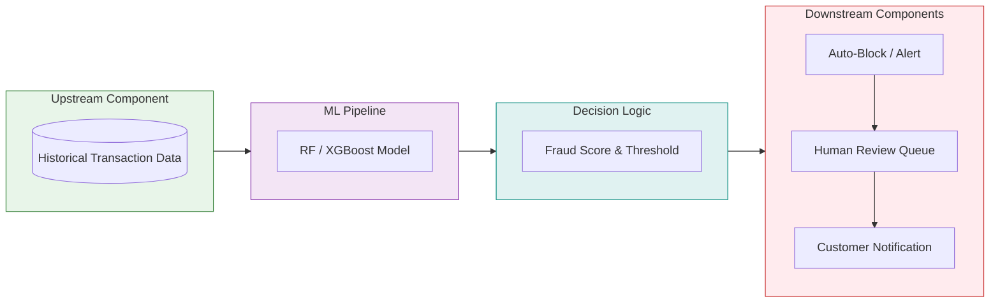
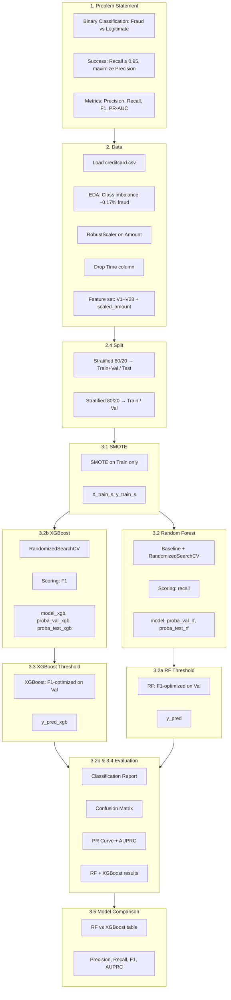
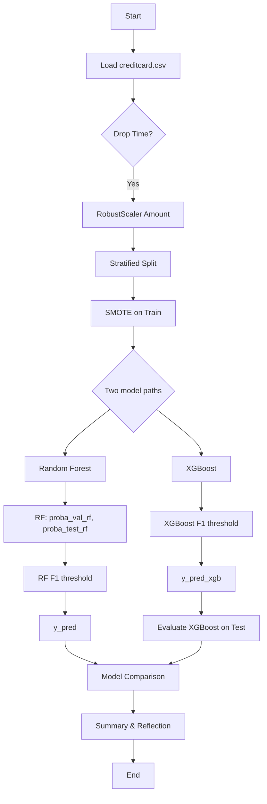

# Credit Card Fraud Detection Using Machine Learning  
## MLP 3: Final Written Report

**Project Title:** Credit Card Fraud Detection  
**Team Members:** Hongru He, Ramya Ramesh  
**Course:** CPSC 5310 Machine Learning  
**Date:** March 2026  

**Git Repository:** [Insert your main GitHub repository link here. Add DialaE as a collaborator for grading.]

---

## Figure 1: System Architecture Diagram (Paste in Notion)



---

## Complete Pipeline Flowchart

This section provides a **complete understanding** of the MLP3 pipeline as a flowchart. The main notebook is `random_forest_MLP3.ipynb`.

### High-Level Flow



### Detailed Step-by-Step Flow

```mermaid
flowchart LR
    subgraph DATA["DATA ACQUISITION"]
        A1[Load CSV] --> A2[EDA]
        A2 --> A3[RobustScaler Amount]
        A3 --> A4[Drop Time]
        A4 --> A5[X: 29 features]
    end

    subgraph SPLIT["SPLIT"]
        B1[Train+Val 80%] --> B2[Test 20%]
        B1 --> B3[Train 80%]
        B1 --> B4[Val 20%]
    end

    subgraph IMB["IMBALANCE"]
        C1[SMOTE on Train] --> C2[X_train_s, y_train_s]
    end

    subgraph MODELS["MODELS"]
        D1[RF: RandomizedSearchCV] --> D2[proba_val_rf, proba_test_rf]
        E1[XGBoost: RandomizedSearchCV] --> E2[proba_val_xgb, proba_test_xgb]
    end

    subgraph THRESH["THRESHOLD (3.2a RF, 3.3 XGBoost)"]
        F1[Scan thresholds 0.01–0.54]
        F2[Max F1 on Val]
        F3[RF: y_pred | XGBoost: y_pred_xgb]
    end

    subgraph EVAL["EVALUATION"]
        G1[Report, CM, PR curve]
        G2[Test set only]
    end

    DATA --> SPLIT
    SPLIT --> IMB
    IMB --> MODELS
    D2 --> THRESH
    E2 --> THRESH
    THRESH --> EVAL
```

### Section-to-Flow Mapping

| Notebook Section | What Happens | Outputs |
|------------------|--------------|---------|
| **1. Problem Statement** | Define binary classification, recall-first objective | — |
| **2. Data** | Load, EDA, RobustScaler, drop Time | X (29 cols), y |
| **2.3 Split** | Stratified train/val/test | X_train, X_val, X_test, y_train, y_val, y_test |
| **3.1 SMOTE** | Over-sample fraud on train only | X_train_s, y_train_s |
| **3.2 RF** | Train RF (no threshold yet) | model, proba_val_rf, proba_test_rf |
| **3.2a RF Threshold** | F1-optimized threshold on RF Val | y_pred, best_thresh_rf |
| **3.2b XGBoost** | Train XGBoost (no threshold yet) | model_xgb, proba_val_xgb, proba_test_xgb |
| **3.3 XGBoost Threshold** | F1-optimized threshold on XGBoost Val | y_pred_xgb, best_thresh_xgb |
| **3.2b & 3.4 Evaluation** | Report, CM, PR curve for RF and XGBoost | Metrics on test |
| **3.5 Comparison** | RF vs XGBoost table | Precision, Recall, F1, AUPRC |
| **4. Summary** | Key findings, XGBoost preferred | — |
| **5. Reflection** | Process, learning, next steps | — |
| **6. Git** | Repo link, DialaE collaborator | — |

### Decision Points



### Key Design Choices

| Choice | Rationale |
|--------|-----------|
| **Drop Time** | Near-zero correlation with Class; no generalizable “first transaction” in production |
| **RobustScaler** | Amount has outliers; median/IQR robust to extremes |
| **SMOTE on train only** | Avoid leakage; Val and Test stay realistic |
| **F1-optimized threshold** | Balances precision and recall (vs recall-only); both RF (3.2a) and XGBoost (3.3) use validation-based threshold selection |
| **XGBoost preferred** | XGBoost outperforms RF (Precision 0.73 vs 0.57, F1 0.79 vs 0.68) |
| **RF kept for comparison** | Both models evaluated with same F1-optimized methodology for fair comparison in 3.5 |

---

## 1. Problem Statement

### 1.1 Goal and Motivation

This project addresses **credit card fraud detection** as a binary classification problem: given a transaction, the model predicts whether it is **fraudulent (Class = 1)** or **legitimate (Class = 0)**. Fraudulent transactions are extremely rare (approximately 0.17% of the dataset), making this a challenging **imbalanced** learning problem.

**Real-world motivation:** Fraud leads to direct financial loss and damages customer trust. The goal is to **minimize missed fraud** (false negatives) while **controlling false alarms** (false positives) so that legitimate customers are not overly burdened. The model is designed to support a **real-time transaction scoring system**: high-confidence fraud triggers automatic blocks or alerts; moderate-confidence cases go to a human review queue.

### 1.2 Task and Success Criteria

- **Input:** Preprocessed transaction features (anonymized PCA components V1–V28 and scaled transaction amount).  
- **Output:** Binary label (0 = legitimate, 1 = fraud).  
- **Success metrics:** We do not use accuracy (misleading under severe imbalance). We use **precision**, **recall**, **F1-score**, and **PR-AUC (Area Under the Precision–Recall Curve)**, with emphasis on **recall for the fraud class**.  
  - **Target:** Achieve **recall ≥ 0.95** (catch at least 95% of frauds), then **maximize precision** at that recall level.  

This reflects the business priority: missing fraud is costlier than extra false alarms, so we explicitly optimize for recall first, then precision.

---

## 2. Data Acquisition, Exploration, and Cleaning

### 2.1 Data Source and Overview

We use the **Credit Card Fraud Detection** dataset (Kaggle / ULB ML Group): 284,807 transactions and 31 columns, all numeric. The target is **Class** (0/1). There are no missing values after basic cleaning.

### 2.2 Exploratory Data Analysis

- **Class distribution:** Severe imbalance—fraud accounts for about 0.17% of transactions.  
- **Features:** V1–V28 are PCA-transformed (anonymized); **Time** is seconds elapsed since the first transaction in the dataset; **Amount** is the transaction amount.  
- **Findings:** Correlation of **Time** with **Class** is near zero (~−0.012). In production, there is no single “first transaction” baseline, so **Time** is not generalizable and was **dropped** from the pipeline.

### 2.3 Preprocessing and Cleaning

- **Amount:** Continuous and skewed with outliers. We apply **RobustScaler** (median and IQR) so that extreme values do not distort the feature scale.  
- **Time:** Permanently **dropped** for the reasons above.  
- **Resulting feature set:** V1–V28 plus **scaled_amount** (29 features total).

### 2.4 Train–Validation–Test Split

We use **stratified** splits so the fraud ratio is preserved:

- 80% train+validation, 20% **test** (held out for **final reporting only**).  
- Of the 80%, we take 80% **train** and 20% **validation** (used for threshold selection and model/hyperparameter choices).

This ensures no data leakage: the test set is used only once for final metrics.

---

## 3. Analysis: Reusable ML Pipeline and Refined Models

### 3.1 Pipeline Overview

Our **reusable ML pipeline** consists of:

1. **Preprocessing:** RobustScaler on Amount; drop Time; feature matrix X (29 columns).  
2. **Stratified split:** Train / validation / test.  
3. **Class imbalance (training only):** **SMOTE** applied **only to the training set** to generate synthetic fraud examples; validation and test sets are unchanged.  
4. **Model:** **Random Forest** classifier on all 29 features (to capture non-linear interactions).  
5. **Threshold selection:** On the **validation set**, we require **recall ≥ 0.95** and choose the decision threshold that **maximizes precision** among those satisfying the recall constraint.  
6. **Evaluation:** Apply the chosen threshold to the **test set** and report classification report, confusion matrix, and Precision–Recall curve (AUPRC).

### 3.2 Baseline and Fine-Tuning

- **Baseline Random Forest (from MLP2):** n_estimators=200, class_weight={0:1, 1:2}, max_depth=12, min_samples_leaf=2.  
- **Refined model (MLP3):** We **fine-tune** the Random Forest using **GridSearchCV** (e.g., over n_estimators, max_depth, min_samples_leaf, class_weight), scoring for **recall** (or F1) to align with our objective. Threshold selection remains on the validation set; the test set is still used only for final metrics.

### 3.3 Evaluation Methods and Results

- **Metrics:** Precision, recall, F1-score, and accuracy are reported for the **fraud class** (and overall where useful). For imbalanced fraud detection, **PR-AUC** is more informative than ROC-AUC.  
- **Figures/tables:** We include (selectively) a **confusion matrix** and a **Precision–Recall curve** on the test set to support key findings.  
- **Result (typical):** With validation-based threshold tuning, we achieve **recall ≥ 0.95** on the test set, meeting the safety-net goal; **precision** remains lower due to the recall-first trade-off and class imbalance.

---

## 4. Summary and Conclusion

### 4.1 Key Findings

- **Recall-first strategy:** By tuning the decision threshold on the validation set (recall ≥ 0.95, then maximize precision), we achieve high recall on the test set, aligning with the business goal of catching nearly all fraud.  
- **Reusable pipeline:** Preprocessing → stratified split → SMOTE on train only → Random Forest (with optional GridSearchCV) → validation-based threshold → test-set evaluation. This pipeline can be maintained, re-run, and monitored with new data or updated hyperparameters.  
- **Fine-tuning:** GridSearchCV over key Random Forest hyperparameters refines the model; validation-based threshold selection keeps the test set unbiased for final reporting.

### 4.2 Communication of Insights

- **Non-technical audience:** The model is tuned to catch almost all fraud (recall ≥ 95%), at the cost of more false alarms. High-confidence predictions can trigger automatic blocks; lower-confidence ones can be routed to human review.  
- **Technical audience:** We use PR-AUC and recall/precision rather than accuracy; SMOTE is applied only on the training set; threshold and hyperparameters are selected without using the test set.

### 4.3 Limitations

- V1–V28 are PCA-derived and not directly interpretable in business terms.  
- The precision/recall trade-off means that very high recall leads to more false positives; further gains may require different sampling strategies or cost-sensitive learning.  
- Model and threshold are tuned on this dataset; production use should include monitoring and periodic retraining.

---

## 5. Reflection on Work and Learning

- **Framing the problem:** We framed the real-world problem as a binary classification task with a **recall-first** objective, consistent with minimizing missed fraud.  
- **Appropriate methods:** We used stratified splits, SMOTE on the training set only, validation-based threshold selection, and metrics (recall, precision, F1, PR-AUC) suited to imbalanced data.  
- **Reusable pipeline:** The pipeline is modular and maintainable: preprocessing, resampling, model training, threshold tuning, and evaluation are clearly separated.  
- **Critical reflection:** Holding out the test set and using the validation set for threshold and model choices improved rigor. Emphasizing PR-AUC and recall over accuracy was important for this domain. Next steps include comparing with the Logistic Regression pipeline on the same test set and exploring cost-sensitive or alternative sampling strategies to improve precision while retaining recall ≥ 0.95.

---

## 6. Deliverables and Repository

- **Notebooks:** `random_forest.ipynb` (this pipeline) and `logistic_regression.ipynb` together provide the full analysis and pipeline for the project.  
- **Repository:** All scripts, notebooks, and relevant files are in the main Git repository. **DialaE** is added as a collaborator for grading.

---

*This report aligns with the ML Project Document and MLP3 requirements: refined models and fine-tuning results, reusable ML pipeline, evaluation methods and results, clear communication for technical and non-technical audiences, and reflection on the process and learning.*
